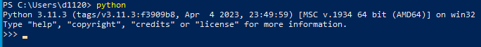

# kaggle-mlflow-davidson
 
## Setup 

To setup your Python environment you will need to install the requirements found in `requirements.txt`. To do this using a virtualenv follow the steps below. I'm using Python 3.11, but any recent version of Python should work ( >=3.7). To see what version is installed by default, run `python` in a terminal. After running, type `exit()` to leave the python interpreter.



On Windows in Terminal:

```
python -m venv venv/
venv/Scripts/activate
pip install -r requirements.txt
```

On MacOS/Linux in Terminal
```
python3 -m venv venv/
source venv/bin/activate
pip install -r requirements.txt
```
## Running the code

To run the code, you need to do `python main.py` from inside your virtualenv. 

## VSCode specifics

Install the Python extension (authored by Microsoft) from the extension marketplace. Next click View (in the top left), click on Command Palette. Then type "Python: Select Interpreter". If you don't see this option, instead type "Developer: Reload Window". This will refresh VSCode and force it to load in the Python extension you just installed. Once you see "Python: Select Interpreter", click it and make sure to select the interpreter that says `'venv': venv`

After you do this, you can click the run button at the top right of `main.py` to run the file instead of typing it each time.

The shortcut for Command Palette is `Ctrl` `Shift` `P`

## Accessing Mlflow

After completing the steps above, in a separate terminal window from where you are running your code, type `mlflow ui`. This will open a connection to the mlflow dashboard. In the terminal output, you will see an address that you can visit to view the mlflow dashboard.
